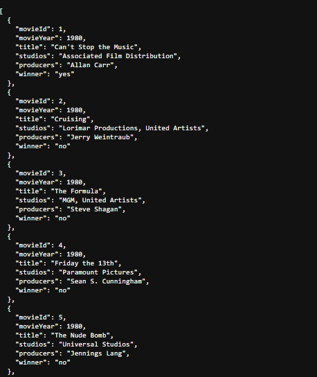
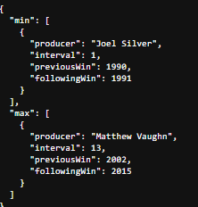

Como rodar o projeto

1. **Clone o repositório**

```bash
git clone https://github.com/Jhxnn/Outsera-Quarkus.git
cd outsera
```

2. **Rode o projeto**
```bash
mvn quarkus:dev
```


3. **Rode os testes**
```bash
mvn test
```


4. Acesse o endpoint no navegador para ver todos os filmes:
   http://localhost:8080/movie


Exemplo de resposta:




5. Acesse o endpoint para ver o maior e menor intervalo de prêmios de um produtor:
   http://localhost:8080/movie/interval

Exemplo de resposta:

